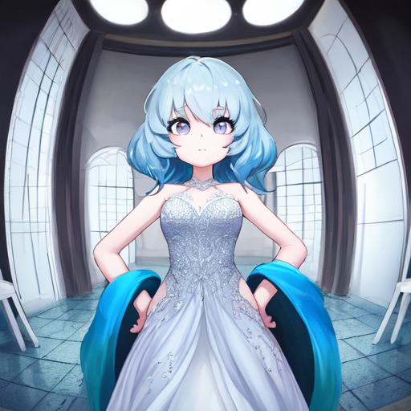

# Regularization Images - Forge - Female Subject

Stable Diffusion training regularization images. Used during LoRA training to reinforce the underlying model and
reduce overfitting.

|             |                                                  |
|-------------|--------------------------------------------------|
| Model       | [f3e - Forge](https://civitai.com/models/160315) |
| Class Tag   | `1girl`                                          |
| Tags        | Booru - WD1.4 `*.txt`                            |                                   
| Sampler     | UniPC                                            |
| Steps       | 20                                               |
| Cardinality | 2019 images                                      |
| VAE         | `kl-f8-anime2`                                   |

## Usage

In the Kohya_SS GUI, select this project directory as the `Regularisation folder` during training.

**Note**: Only use these regularization images if training against the f3e model. Training with regularization images
from a different model will heavily bake that style into the result.
